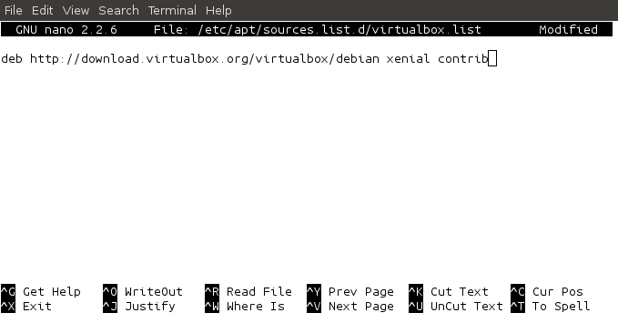
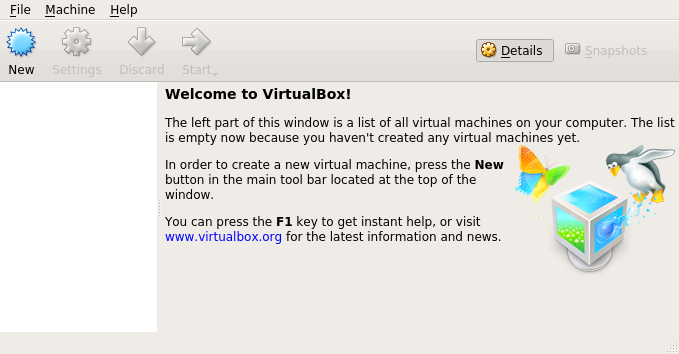
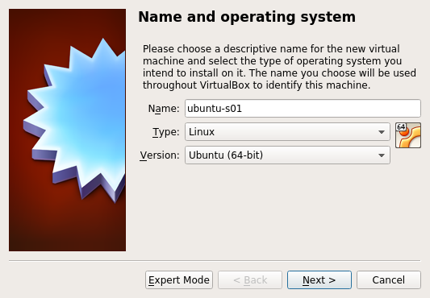
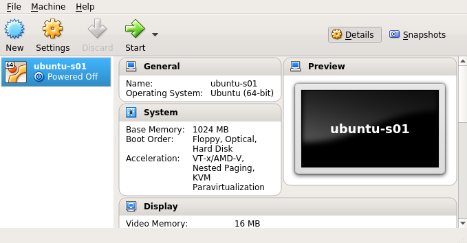
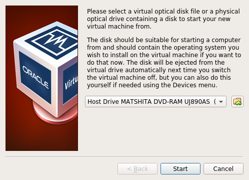

* TOC
{: toc}

# Introduction

The purpose of this lab is to introduce you to some package management tools
for Ubuntu, to show you how to install Virtualbox on your system, and to get
you to install an Ubuntu operating system from scratch, using Virtualbox. This
will give you an environment that you can use safely in the lab, and also that
you can install and use on your home PC, if you wish. The lab will involve the
use of some commands with which you may not be familiar. At this stage, we'll
just introduce enough to allow you to use the commands to achieve the goals of
the lab. We'll revisit many of these commands in later weeks and explain them
in more detail.

Before going any further, make sure that your machine is powered on and running
the Ubuntu operating system.

# Package Management
The labs contain desktop PCs running a version of the
[Ubuntu](https://www.ubuntu.com/) operating system.  The first steps in
mastering your operating system are to become familiar with the tools for
[installing software](https://help.ubuntu.com/community/InstallingSoftware) and
[package
management](https://help.ubuntu.com/lts/serverguide/package-management-introduction.html),
so that you can install and remove software to configure the environment to
suit your needs.


There are a number of tools in Ubuntu that support package management, including
[dpkg](https://help.ubuntu.com/lts/serverguide/dpkg.html), [apt](https://help.ubuntu.com/lts/serverguide/apt.html), [apt-get](https://help.ubuntu.com/community/AptGet/Howto), [aptitude](https://help.ubuntu.com/lts/serverguide/aptitude.html), [synaptic](https://help.ubuntu.com/community/SynapticHowto), and [Ubuntu software center](https://help.ubuntu.com/community/UbuntuSoftwareCenter).

In this session we are going to use the command line tools `dpkg` and `apt-get`,
since they can be used to manage packages in both desktop and server environments.
We'll use them to set up our environment with the `Virtualbox` tool that we'll be
using extensively in this module.

1. First, use `dpkg` to check that some standard packages are installed on your system, e.g.

     ```sh
     $ dpkg -l | grep gedit
     ```
     {: .code}
This command will search through the names of all of the packages installed on your system and report any that contain
the work `gedit` in them. It's an easy way to check whether or not `gedit` is installed.

     ```sh
     dpkg -l | grep gcc
     ```
     {: .code}
This command does a similar job and allow us to check that we have a C compiler installed.

     ```sh
     $ dpkg -l | grep make_nufc_champions_league_winners
     ```
     {:.code}
This command also behaves the same as before, but this time comes up with no entries, since there is not yet any software package
that has this functionality and therefore it cannot be installed.
Now check whether or not `Virtualbox` is already installed on your system.

     ```sh
     $ dpkg -l | grep virtualbox
     ```
     {:.code}
If there is an entry for `virtualbox-5.1` then `Virtualbox` is already installed and you can skip to `Using Virtualbox`.

2. To install software packages from the command line, use `apt-get`, which will download the required package and any
dependencies from the software repositories that it knows about, and install it for you. The list of software repositories
is maintained mainly in a file, `/etc/apt/sources.list`, but also in a set of smaller files, contained in the directory
`/etc/apt/sources.list.d`. Use the `less` and `ls` commands to have a look at the known repositories:

     ```sh
     $ less /etc/apt/sources.list
     ```
     {: .code}
Use the space bar to page through the list and press `q` when you want to stop.

     ```sh
     $ ls /etc/apt/sources.list.d
     ```
     {: .code}
We'll create a new file in `/etc/apt/sources.list.d` to hold a reference to our `Virtualbox` repository. You can use any text editor
with which you are familiar to do this. You'll need to start the editor as the `superuser` since you'll be writing to a directory that
is protected against modification by general users. The most useful editors to use from the command line are `vim` and `nano`. Here's an
example of what you should do using `nano`.

     ```sh
     $ sudo nano /etc/apt/sources.list.d/virtualbox.list
     ```
     {: .code}
Now copy and paste the line below into your new file. Note that this is the correct repository for use on Ubuntu 16.04. If you
have a different version of Ubuntu, you will need to change `xenial` to match your distribution name, e.g. `trusty` for 14.04.

     ```sh
     deb http://download.virtualbox.org/virtualbox/debian xenial contrib
     ```
     {: .code}
<br/>

then save the file and exit from `nano`.

3. Add the Oracle public keys for *apt-secure*. These are used in checking that the downloads really are from Oracle.

     ```sh
     wget -q https://www.virtualbox.org/download/oracle_vbox_2016.asc -O- | sudo apt-key add -
     wget -q https://www.virtualbox.org/download/oracle_vbox.asc -O- | sudo apt-key add -
     ```
     {: .code}

4. Before you can install `Virtualbox`, you will need to synchronise the package index files from their sources, as follows:

     ```sh
     $ sudo apt-get update
     ```
     {: .code}
Then you can install `Virtualbox`, using the command

     ```sh
     $ sudo apt-get install virtualbox-5.1
     ```
     {: .code}
This is quite a large package and installation may take a few minutes. When the installation completes, you can start `Virtualbox` from the command line,
as follows:

     ```sh
     $ virtualbox &
     ```
     {: .code}
You should see a window that looks like the one below.


*Note there is further guidance for downloading Virtualbox at [https://www.virtualbox.org/wiki/Linux_Downloads](https://www.virtualbox.org/wiki/Linux_Downloads).*

# Using Virtualbox
We'll begin by installing a version of Ubuntu Server. We'll be able to do most of the lab work for this module on this system. It is significantly smaller
than the desktop version. We'll use a variety of systems during the module but this will be the primary one.

## Download OS image
Ubuntu is distributed from the [Ubuntu website](https://www.ubuntu.com/download) using DVD images that are provided in the form of [.iso](https://en.wikipedia.org/wiki/ISO_image) files. We are going to use Ubuntu Server 16.04. You can download the iso image using the following commands:

```sh
$ cd ~/Downloads
$ wget http://releases.ubuntu.com/xenial/ubuntu-16.04.3-desktop-amd64.iso
```
{: .code}
The file is about 619M in size and so will take a few minutes to download.

## Create a new virtual machine

1. Select `New` in the `Virtualbox Machine Manager` (VMM) window. Give your machine a name, as below.


2. Click `Next`. Continue to accept the default options until your new virtual machine (VM) has been created. You should
have a window that looks like the one below.


## Install the OS image

1. Select the VM and click `Start`. Select icon with the green upward arrow and browse to the location of your .iso image file. Select the image file
and the OS will begin its installation procedure, just as it would on a 'real' machine.

2. Choose English as the language and select `Install Ubuntu Server` from the next menu.
3. Choose `English` again from the Installation Language menu, then `United Kingdom` when prompted to select your location.
4. Continue to select the default options until you get to `Configure the network` and need to enter a hostname. Choose a name based on
your University computer name, e.g `w12345678`, and your server name, e.g. `s01`, so the host name that you choose might be
`w12345678-s01`.
5. Enter your full name when prompted, e.g. `John Smith`.
6. You can just use `student` and `northumbria` when prompted for a user name and password.
7. Just choose the defaults until you get to `Partition disks` when you should choose the first option `Guided - use entire disk`
8. Select the disk that you are offered. Don't worry about the warnings - the 'disk' is not the whole hard drive, it's just the one
that you created when you created the VM.
9. At the prompt `Write changes to disk`, choose `Yes`.
10. Allow the system to continue installing for a minute or two.
11. At the prompt for `HTTP proxy`, leave the entry blank and `Continue`.
12. Allow the installation to continue, selecting the defaults until you get to `Software selection`. Use the space bar
to select `OpenSSH server` and then `Continue`. Allow the installation to proceed for a minute or two.
13. When prompted to `Install the GRUB boot loader to the master boot record`, choose `Yes`.
14. Choose `Continue` when prompted to `Finish the installation`.

Congratulations!!! You have just completed a full install of an Ubuntu Server operating system.

## Using your new operating system

1. Before going further, it's a good idea to update the packages on your new server, as follows:

     ```sh
     $ sudo apt-get update
     $ sudo apt-get upgrade
     ```
     {: .code}
2. You've going to need a C compiler and the Ubuntu server doesn't have one yet. Time to install one.

     ```sh
     sudo apt-get install gcc
     ```
     {: .code}
3. Although we used the `nano` editor earlier in this lab, there are many good
   editors available for Unix/Linux. One powerful editor that is always likely
   to be available on your system, whether desktop or server, is `vim`. It's an
   'old-school' editor but still [the editor of choice for DevOps and Sys
   admins](http://stackoverflow.com/research/developer-survey-2015?ref=survey-2016#tech-editor).
   In other words, if you need to look after an operating system, it's a good
   idea to know how to use `vim`, at least for basic editing tasks. The source
   code of this web page was written using `vim`. `vim` is a *modal* editor
   and, as such, is different from any editor that you've used before. Start by
   working through the `vimtutor`. It should take you about 30 minutes.

     ```sh
     $ vimtutor
     ```
     {: .code}
4. Now check your understanding of `vim` and your C compiler by writing and executing the traditional `helloworld`
program. Use `vim` to enter the text below.

     ```c
     #include <stdio.h>

     int main() {
      printf("Hello world\n");
      return 0;
     }
     ```
     {: .code}
Save the file as `helloworld.c`, then compile and run it.

     ```sh
     $ gcc -o helloworld helloworld.c
     $ ./helloworld
     ```
     {: .code}
5. When you're ready to shut down your system, you can do this from the command line using the `shutdown` command.

     ```sh
     $ sudo shutdown -h now
     ```
     {: .code}

# Homework
The main advantage for you in this module of knowing how to use `Virtualbox` is that you can create an Ubuntu
system that will run on your home PC. This means that you'll be able to carry on working and exploring the
operating system when you're not in a University lab.

1. If you decide that you would like to be able to run an Ubuntu system on your Windows or Mac machine, visit
the [virtualbox home page](https://www.virtualbox.org/). Download the installtion program for your system and
install `Virtualbox` on your machine.

2. Now work through the section above, `Using Virtualbox`, again, on your new system.

3. If you're feeling adventurous, you could also download and install an Ubuntu
   desktop operating system for use at home. If you want an environment that is
   just the same as the lab environment, you should download Ubuntu 16.04.1
   Xenial Xerus. If you have a 64-bit Windows machine you should download
   [http://releases.ubuntu.com/16.04.1/ubuntu-16.04.1-desktop-amd64.iso](http://releases.ubuntu.com/16.04.1/ubuntu-16.04.1-desktop-amd64.iso).
   If you have a different machine, you should check the Ubuntu website for
   guidance about which image to download. Once you have download the image,
   you may find the [installation
   instructions](https://www.ubuntu.com/download/desktop/install-ubuntu-desktop)
   useful. See also the [official Ubuntu
   documentation](https://help.ubuntu.com/?_ga=1.91123738.1612699279.1407321706).
4. You can develop your `vim` skills further by using the resources at
[Learning Vim for Beginners](https://www.labnol.org/internet/learning-vim-for-beginners/28820/).
