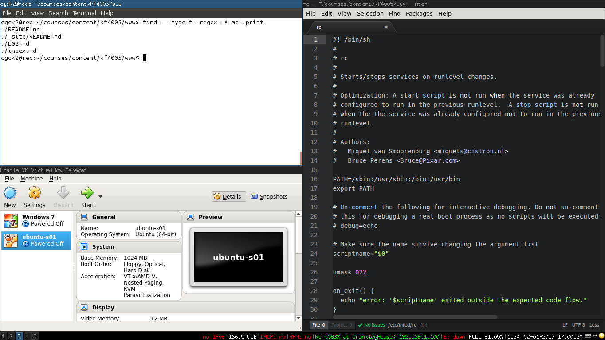

## Introduction

An operating system is the software that allows your applications to make use of
the hardware resources of your computing devices. Whether it’s a video streaming
application on your laptop, a messaging app on your smartphone or a web server
in a huge data centre, they all rely on the services of an operating system to
work. This module will help you to understand what an operating system is, how
it works and how to manage it.

You will be taught in well-equipped computing
laboratories with modern operating systems that you can investigate and
experiment with. Your understanding of operating systems concepts and your
practical skills in working with operating systems will be assessed in lab-based
coursework exercises. This module will help you to develop a sound understanding
of a key component in any computing system and will inform your thinking at
every stage of your computing career.

Lectures are the main vehicle for introducing fundamental concepts and
principles and for providing context and motivation. You will be
expected to prepare for lecture topics and deepen your understanding
of course material by studying course texts and technical
literature. Seminars and laboratory sessions support the lecture
programme by providing you with opportunities to identify and
apply appropriate techniques for the application and implementation of
a variety of OS services.

## Staff Information

|   |    |
|---|:---|
|Module Tutor &nbsp;  | [David Kendall](http://computing.northumbria.ac.uk/staff/cgdk2)|
|Lecturer      | [Alun Moon](https://www.northumbria.ac.uk/about-us/our-staff/m/alun-moon/)|
|Lecturer      | [Kezhi Wang](https://sites.google.com/site/drkezhiwang/)|

## Teaching Arrangements

|   |    |
|---|:---|
**Lecture (Block B)** &nbsp;| Mon 11.00 - 12.00 ELA 102a
**Lecture (Block A)** | Tue 10.00 - 11.00 ELA 002
**Lab/Seminar**       | Tue 15.00 - 17.00 PAN S3
**Lab/Seminar**       | Wed 09.00 - 11.00 PAN F2/F3
**Lab/Seminar**       | Fri 11.00 - 13.00 PB S3

You should attend <em>both</em> lecture sessions and <em>one</em> of the
lab/seminar sessions every week. Refer to your personal timetable to identify
the lab session that you should attend.

## Synopsis

This module introduces you to the fundamentals of operating systems:
processes/threads, communication, memory management, file systems, I/O,
security, scripting languages and tools. You will study:

1. processes and threads: concepts, use and implementation, creation and
destruction, context switching, scheduling;

2. communication (IPC): shared memory, message passing, pipes;

3. memory management: memory allocation schemes, paging, virtual memory;

4. persistent storage and file systems: file concept, file system structure and
implementation, directories, free space allocation;

5. I/O: input and output devices, device handlers, the I/O API;

6. security:  access control, user authentication;

7. scripting languages and tools: use of languages and tools (e.g. the command
shell, Python) for monitoring, investigating and administering an operating
system and its resources.

## Teaching Plan / Learning Materials

The following is a *provisional* guide to the organisation of
this part of the module for this year. These arrangements are subject to
change during the course of the module.

| Week   | W/c   | Lecture A   | Lecture B   | Practical   |
| :----: | :---: | :---------: | :---------: | :---------: |
**1** | 15-Jan &nbsp; | [Introduction and overview]({{site.baseurl}}{{site.raurl}}/A01.pdf) &nbsp; | [Introduction to Unix/Linux]({{site.baseurl}}{{site.raurl}}/B01.pdf) &nbsp; | [Introduction to lab environment and tools](L01.html)
**2** | 22-Jan &nbsp; | [C programming for OS]({{site.baseurl}}{{site.raurl}}/A02.pdf) | [Linux command line]({{site.baseurl}}{{site.raurl}}/B02.pdf) &nbsp;   Reading: [SHO16, Chp. 1-6, 9]({{site.baseurl}}{{site.raurl}}/TLCL.pdf)  | [Learning the Linux command line](L02.html)
**3** | 29-Jan &nbsp; | [Process concept]({{site.baseurl}}{{site.raurl}}/A03.pdf) &nbsp;   Reading: [A-D15 Chp. 4](http://pages.cs.wisc.edu/~remzi/OSTEP/cpu-intro.pdf)| [Shell scripts]({{site.baseurl}}{{site.raurl}}/B03.pdf) &nbsp;   Reading: [SHO16, Chp. 24, 25, 27]({{site.baseurl}}{{site.raurl}}/TLCL.pdf) | [Writing shell scripts](L03.html)
**4** | 05-Feb &nbsp; | [Process scheduling]({{site.baseurl}}{{site.raurl}}/A04.pdf) &nbsp;   Reading: [A-D15 Chp. 7](http://pages.cs.wisc.edu/~remzi/OSTEP/cpu-sched.pdf)| [Linux processes]({{site.baseurl}}{{site.raurl}}/B04.pdf) &nbsp;   Reading: [A-D15 Chp. 5](http://pages.cs.wisc.edu/~remzi/OSTEP/cpu-api.pdf)| [Shell functions. Working with processes](L04.html)
**5** | 12-Feb &nbsp; | [Memory management&nbsp;1]({{site.baseurl}}{{site.raurl}}/A05.pdf) &nbsp;   Reading: [A-D15 Chp. 13](http://pages.cs.wisc.edu/~remzi/OSTEP/vm-intro.pdf)| [Linux IPC]({{site.baseurl}}{{site.raurl}}/B05.pdf) &nbsp;   Reading: [SHO16, pp 118-121, 496-502]({{site.baseurl}}{{site.raurl}}/TLCL.pdf)| [Linux IPC: Signals and pipes](L05.html)
**6** | 19-Feb &nbsp; | [Memory management&nbsp;2]({{site.baseurl}}{{site.raurl}}/A06.pdf) &nbsp;   Reading: [A-D15 Chp. 15](http://pages.cs.wisc.edu/~remzi/OSTEP/vm-mechanism.pdf)| [POSIX threads]({{site.baseurl}}{{site.raurl}}/B06.pdf) &nbsp;   Reading: [A-D15 Chp. 26](http://pages.cs.wisc.edu/~remzi/OSTEP/threads-intro.pdf), [A-D15 Chp. 27.1-2](http://pages.cs.wisc.edu/~remzi/OSTEP/threads-api.pdf) | [Threads; basic memory management in the shell](L06.html)
**7** | 26-Feb &nbsp; | [Introduction to SQL]({{site.baseurl}}{{site.raurl}}/A07.pdf) | [Introduction to SQL]({{site.baseurl}}{{site.raurl}}/B07.pdf) | [SQL practical](L07.html) &nbsp;   Introduction to the assignment
**8** | 05-Mar &nbsp; | [Storage management&nbsp;1]({{site.baseurl}}{{site.raurl}}/A08.pdf) &nbsp;   Reading: [AD-15 Chp. 39](http://pages.cs.wisc.edu/~remzi/OSTEP/file-intro.pdf) | [Linux file system]({{site.baseurl}}{{site.raurl}}/B08.pdf) &nbsp; | [Working with file systems](L08.html)
**9** | 12-Mar &nbsp; | [Storage management&nbsp;2]({{site.baseurl}}{{site.raurl}}/A09.pdf) &nbsp;   Reading: [SGG12 Chp. 11] | [More shell - text processing]({{site.baseurl}}{{site.raurl}}/B09.pdf) &nbsp;   Reading: [SHO16, Chp. 19, 20]({{site.baseurl}}{{site.raurl}}/TLCL.pdf) | [Shell - text processing](L09.html)
**10** | 19-Mar &nbsp; | [Protection and security&nbsp;1]({{site.baseurl}}{{site.raurl}}/A10.pdf) &nbsp; | [Linux protection and security]({{site.baseurl}}{{site.raurl}}/B10.pdf) &nbsp; | [Linux protection and security](L10.html)
**11** | 16-Apr &nbsp; | [Protection and security&nbsp;2]({{site.baseurl}}{{site.raurl}}/A11.pdf) &nbsp; | [Linux devices]({{site.baseurl}}{{site.raurl}}/B11.pdf) &nbsp; | [Assignment review](L11.html)
**12** | 23-Apr &nbsp; | [Review]({{site.baseurl}}{{site.raurl}}/A12.pdf) &nbsp; | [Review]({{site.baseurl}}{{site.raurl}}/B12.pdf) &nbsp; | [Practical assignment completion](L12.html)

 

In addition to the taught sessions, you are expected to undertake
independent and directed learning. This is a 20-credit module, for
which the expected student workload is 200 hours. Over the course of a
15-week semester, you should be spending about 13 hours per week on
this module.

## Assessment

Formative assessment comprises a variety of theoretical and practical exercises,
with opportunities for discussion with tutors and colleagues.
Feedback on formative assessment will be given during the workshop sessions.

Summative assessment comprises a single coursework assignment. You will be
required to undertake a number of theoretical and practical, lab-based
exercises, leading to the completion of a set of questions about the work that
you have done. It is your responsibility to ensure that you are familiar
with the assessment regulations and that you comply with them in providing your 
summative assessment.

[**Assessment regulations and guidance**](https://www.northumbria.ac.uk/about-us/university-services/academic-registry/quality-and-teaching-excellence/assessment/guidance-for-students/)

Formal written feedback will be provided on summative assessment. The assignment
will assess all of the MLOs.

<a class="btn btn-large btn-primary" href="{{site.baseurl}}{{site.raurl}}/assgn.pdf"><i
class="icon-upload-alt"></i>Download Assignment Specification</a>

## Reading List

There is no essential textbook for this module. [SGG14] is an excellent
introduction to operating systems in general and can be used to supplement the
slides for the Lecture A stream of the module. [A-D15] also covers much of this
material and has the advantage of being available *free online*. The other
recommended books and papers give useful information on parts of the syllabus
only.

* **Books**
  - **[SGG12]** Silberschatz, A., Galvin, P., and Gagne,
G., [Operating System Concepts](https://www.amazon.co.uk/Operating-System-Concepts-Abraham-Silberschatz/dp/1118063333/ref=sr_1_1?ie=UTF8&qid=1488129879&sr=8-1&keywords=silberschatz), John Wiley, 9th edition, 2012, ISBN-13: 978-1118063330

  - **[A-D15]** Arpaci-Dusseau, R. and Arpaci-Dusseau, A., [Operating systems: Three easy pieces](http://www.ostep.org), Arpaci-Dusseau Books, 2015

  - **[DOW08]** Downey, A., [The Little Book of
Semaphores](http://www.greenteapress.com/semaphores/) ([Local copy]({{site.baseurl}}{{site.raurl}}/downey08semaphores.pdf)), Green Tea Press, 2002   A free text book by Allen Downey that introduces a variety of interesting synchronisation
problems and their solution using semaphores.

  - **[SHO16]** Shotts. W., [The Linux Command Line](http://linuxcommand.org/tlcl.php) ([Local copy]({{site.baseurl}}{{site.raurl}}/TLCL.pdf)), No Starch Press, 2016   A free text book by William Shotts on using the Linux command line.

## Resources

* **Programming in C/C++**
  - **[KOC04]** Kochan, S., [Programming in C](http://www.amazon.co.uk/Programming-Developers-Library-Stephen-Kochan/dp/0672326663/ref=sr_1_5?ie=UTF8&amp;qid=1316089219&amp;sr=8-5), Sams, 2004  
A gentle introduction to programming in C. I think it's a better starting
point than the much-recommended Kernighan and Ritchie.

  - **[PRI02]** Prinz, P., [C Pocket Reference](http://www.amazon.co.uk/C-Pocket-Reference-Peter-Prinz/dp/0596004362/ref=sr_1_1?s=books&amp;ie=UTF8&amp;qid=1285570456&amp;sr=1-1), O'Reilly, 2002  
A concise C reference. Very cheap. Less than a fiver the last time I
looked. I suggest you buy a copy and read it from cover to cover.
  - [Essential C](http://cslibrary.stanford.edu/101/EssentialC.pdf), Parlante, N, Stanford University, 2003  
A very good summary of the basic features of the C language.
  - [Learn C Programming](http://tutorialspoint.com/cprogramming/)   A nice online C programming tutorial site.
  - [C Programming](http://www.imada.sdu.dk/~svalle/courses/dm14-2005/mirror/c/)  
An online course on C Programming from the University of Strathclyde.
  - [Practical Programming in C](http://ocw.mit.edu/courses/electrical-engineering-and-computer-science/6-087-practical-programming-in-c-january-iap-2010/index.htm)   A detailed introduction to C from the MIT Open Courseware catalogue. If you skip the material on data structures and concurrency, you're left
with a good basic introduction to C. The data structures and concurrency
sections cover more advanced material.
* **Linux/ Mac OS X**
  - [linuxcommand.org](http://linuxcommand.org) An excellent online tutorial on using the Linux command line and creating shell scripts
  - Bash Guide for Beginners [www](http://tldp.org/LDP/Bash-Beginners-Guide/html/), [pdf](http://tldp.org/LDP/Bash-Beginners-Guide/Bash-Beginners-Guide.pdf)
  - Apple Developer [Shell Scripting Primer](https://developer.apple.com/library/content/documentation/OpenSource/Conceptual/ShellScripting/shell_scripts/shell_scripts.html)
  - Gnu/Linux Command-Line Tools Summary [www](http://linux.die.net/Linux-CLI/), [pdf](http://tldp.org/LDP/GNU-Linux-Tools-Summary/GNU-Linux-Tools-Summary.pdf)
  - Advanced Bash-Scripting Guide [www](http://tldp.org/LDP/abs/html/)
  - Raymond, E., [The Art of Unix Programming](http://www.catb.org/esr/writings/taoup/), Addison Wesley, 2008
  - The IEEE and The Open Group, [POSIX.1-2008](http://pubs.opengroup.org/onlinepubs/9699919799/), 2001-2016
* **Git**
  - [Git home page](https://git-scm.com)
  - [Git official documentation](https://git-scm.com/doc)
  - [Good resources for learning Git and Github](https://help.github.com/articles/good-resources-for-learning-git-and-github/)
  - [15-minute tutorial in your browser](https://try.github.io)
  - [Video introduction](https://git-scm.com/videos)
  - [Student developer pack](https://education.github.com/pack)   Get free
    stuff from GitHub Education, including a GitHub account with unlimited
    private repositories (normally 7$/month)
